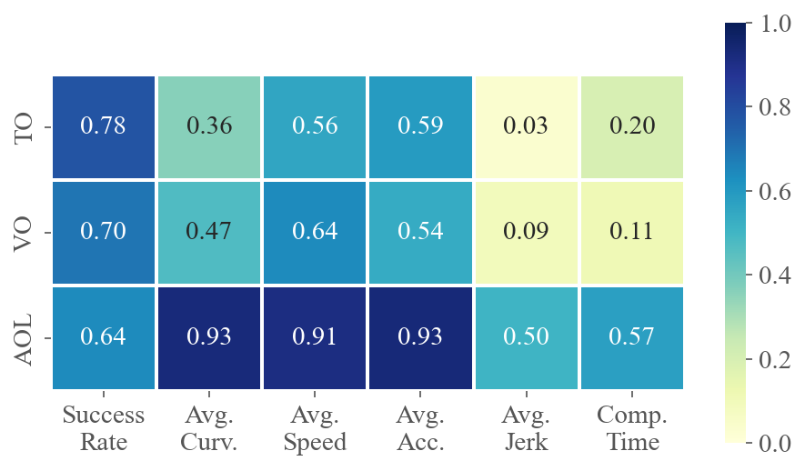
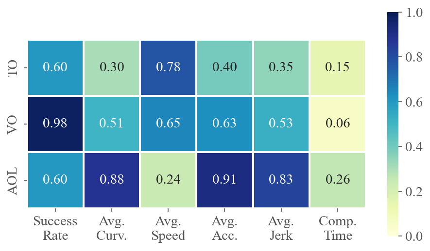
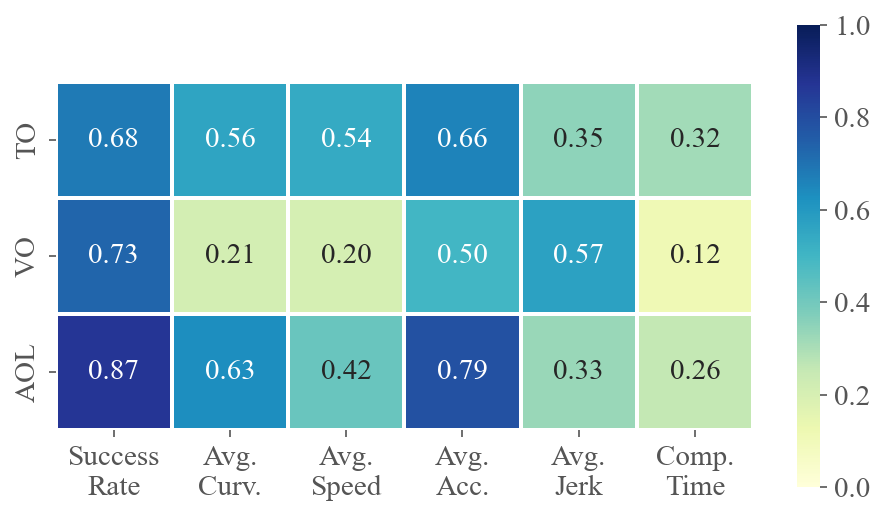

# Welcome to FlightBench
*FlightBench* is an unified open-source benchmark for planning methods on ego-vision-based navigation for quadrotors built on [Flightmare](https://github.com/uzh-rpg/flightmare). *FlightBench* provides cusomizable test scenarios (including three quantitative task difficulty metrics), representative planning algorithms, and comprehensive evaluation metrics. Here's an overview of FlightBench.


---

The code is available [here](https://github.com/thu-uav/FlightBench). For details on the experimental setup and conclusions, please refer to our [paper](https://arxiv.org/abs/2406.05687).

## 🔥News
[2024-11-24] 🎁 We have added our implementation details and full experimental results to Section [Additional Results](#additional-results).

# Table of Contents
1. [Introduction](#welcome-to-flightbench)
2. [Table of Contents](#table-of-contents)
3. [Installation](#installation)
4. [Benchmark Design](#benchmark-design)
5. [Let's Fly](#lets-fly)
6. [Train Own Policy](#train-own-policy)
7. [Additional Results](#additional-results)
8. [Citation](#citation)

# Installation
Before starting the installation, please add your ssh key to github.
## Environment
- The installation is tested on Ubuntu-20.04
- An Nvidia GPU with installed drivers is necessary for rendering and RL training. CUDA>=11.1 is also necessary.
- [ROS Noetic](http://wiki.ros.org/noetic/Installation)
- [Gazebo 11](https://classic.gazebosim.org/)
- [Python 3.8](https://www.python.org/downloads/release/python-380/). We recommend using python virtual environment. Use `sudo apt install python3-venv` to install
- [gcc/g++ 9](https://gcc.gnu.org/releases.html)

## Install FlightBench
Install the benchmark platform by the following commands:

```bash
mkdir flightbench_ws && cd flightbench_ws
mkdir src && cd src
sudo apt-get update && sudo apt-get install git cmake python3 python3-dev python3-venv python3-rosbag
git clone git@github.com:thu-uav/FlightBench.git
cd FlightBench
git submodule update --init --recursive

# Add FLIGHTMARE_PATH environment variable to .bashrc file:
echo "export FLIGHTMARE_PATH=path/to/FlightBench" >> ~/.bashrc
source ~/.bashrc

# We recommend using python virtual env to manage python packages
python3 -m venv flightpy # or any other name you like
source flightpy/bin/activate # active the venv

# install packages for training using pip
cd $FLIGHTMARE_PATH/flightrl
sudo apt-get install build-essential cmake libzmqpp-dev libopencv-dev libeigen3-dev
pip install -r requirements.txt
cd $FLIGHTMARE_PATH/flightlib

# install flightgym
pip install .

# install MAPPO
cd $FLIGHTMARE_PATH/flightrl
pip install -e .
```

Then install ROS part.
```bash
sudo apt-get update
export ROS_DISTRO=noetic
sudo apt-get install libgoogle-glog-dev protobuf-compiler ros-$ROS_DISTRO-octomap-msgs ros-$ROS_DISTRO-octomap-ros ros-$ROS_DISTRO-joy python3-vcstool python3-empy ros-$ROS_DISTRO-mavros
sudo pip install catkin-tools

# go flightbench_ws 
cd flightbench_ws
catkin config --init --mkdirs --extend /opt/ros/$ROS_DISTRO --merge-devel --cmake-args -DPYTHON_EXECUTABLE=/usr/bin/python3 -DCMAKE_BUILD_TYPE=Release

catkin build
```

## Install Baselines
```bash
# import benchmarks
cd src
vcs-import < FlightBench/flightbench/benchmarks.yaml

# install deps
sudo apt-get install libarmadillo-dev libglm-dev
# instsll nlopt
# go flightbench_ws 
cd flightbench_ws
git clone https://github.com/stevengj/nlopt.git
cd nlopt
mkdir build
cd build
cmake ..
make
sudo make install
# install Open3d
cd flightbench_ws
git clone --recursive https://github.com/intel-isl/Open3D
cd Open3D
git checkout v0.9.0
git submodule update --init --recursive
./util/scripts/install-deps-ubuntu.sh
mkdir build
cd build
cmake -DCMAKE_INSTALL_PREFIX=/usr/local/bin/cmake ..
make -j$(nproc)
sudo make install

# compile baselines
cd flightbench_ws
catkin build
```

Install python packages for agile autonomy
```bash
# activate flightpy
source path/to/flightpy/bin/activate
cd path/to/benchmark_agile_autonomy
pip install -r requirements.txt
```

Install benchmark_sb_min_time
```bash
sudo apt-get install build-essential cmake pkg-config ccache zlib1g-dev libomp-dev libyaml-cpp-dev libhdf5-dev libgtest-dev liblz4-dev liblog4cxx-dev libeigen3-dev python3 python3-venv python3-dev python3-wheel python3-opengl
# into sb_min_time dir
cd benchmark_sb_min_time
git submodule update --init --recursive
make dependencies
make
```

# Benchmark Design
## Use Existing or Custom Scenarios
### Use our scenarios

We provide 3 distinct scenarios: forest, maze, and multi-waypoint. 


1. Download scene folder from [here](https://drive.google.com/file/d/1eBNju9oelVIcZc-yNd5Tm5ABRCHuhc8S/view?usp=drive_link) and put it to `path/to/FlightBench/scene` after unzip.
2. Download render file from [here](https://drive.google.com/file/d/1drIRfkAV6kT5JHh0CO3Wud2SCRIIKZUF/view?usp=drive_link). Put it into `path/to/FlightBench/flightrender` after unzip.

### Customize own scenarios
The Scenarios are customized using [Unity](https://unity.com/). Our unity project is forked from [flightmare_unity](https://github.com/uzh-rpg/flightmare_unity). You may choose to start with either [flightmare_unity](https://github.com/uzh-rpg/flightmare_unity) or [our project](https://drive.google.com/file/d/1lNC0sASTxGhFCxRiMWLlStGgc98iget2/view?usp=drive_link) for modifications.

1. Install Unity hub following [offical document](https://docs.unity3d.com/hub/manual/InstallHub.html)
2. Add a project, unity hub will automatically prompt whether to install unity editor (2020.1.10f1)
3. Then you can edit and build the project following [this](https://flightmare.readthedocs.io/en/latest/building_flightmare_binary/standalone.html#)
4. Place the compiled files into `path/to/FlightBench/flightrender`.

Based on Unity, the **dynamic obstacles** are also supported by scripting. For instance, add the following scripts to your obeject to enable an oribit move.
```cs
using System.Collections;
using System.Collections.Generic;
using UnityEngine;

public class orbit : MonoBehaviour
{
    public Transform target;
    public float speed = 2f;
    // Start is called before the first frame update
    void Start() {}
    // Update is called once per frame
    void Update()
    {
        Vector3 targetPos = target.position;
        Vector3 orbitPos = new Vector3(targetPos.x, transform.position.y, targetPos.z);
        Vector3 direction = (orbitPos - transform.position).normalized;
        float distanceToMove = speed * Time.deltaTime;
        Vector3 y = new Vector3(0, 1, 0);
        Vector3 newPosition = transform.position + Vector3.Cross(direction, y) * distanceToMove;
        transform.position = newPosition;
        transform.LookAt(targetPos);
    }
}
```


For training and evaluating RL-based methods, a scene folder should be organized as follow:
```
scene
|-- <scene_name_0>
|   |-- env.ply
|   |-- env-surface.ply
|   |-- roadmap_shortened_unique_path0_0.csv
|   |-- roadmap_shortened_unique_path1_0.csv
|   |-- roadmap_shortened_unique_pathn_0.csv
|       
|-- <scene_name_1>
|   |-- env.ply
|   |-- env-surface.ply
|   |-- roadmap_shortened_unique_path0_0.csv
|   |-- roadmap_shortened_unique_path1_0.csv
|   |-- roadmap_shortened_unique_pathn_0.csv
|
|-- <scene_name_2>
|   ...
```
`env.ply` is the pointcloud file of the scenario, which can be generated by clicking the 'scene save pointcloud' bottom after compiling the unity project.

[This section (Evaluate task difficulty)](#evaluate-task-difficulty) shows the generation of `env-surface.ply` and `roadmap_shortened_unique_path`.

Then put the folder into `path/to/FlightBench/scene` to support RL training and evluating.

## Perception & control interface
### Perception data
RGBD image, odometry, and imu sensor data are provided. User can subscribe the following topics for flying.

- `/<quad_name>/ground_truth/odometry`: pose and velocity (both linear and angular) under body frame
- `/<quad_name>/ground_truth/imu`: imu data, containing angular velocity and linear acceleration under body frame
- `/<quad_name>/flight_pilot/rgb`: a rgb8 encoding `sensor_msgs.Image` message, containing the ego-vision rgb image.
- `/<quad_name>/flight_pilot/depth`: a 32fc1 encoding `sensor_msgs.Image` message, containing the ego-vision depth image.

Users can enable/disable the RGB and Depth topic separately by modifying `path/to/FlightBench/flightros/params/default.yaml`.

### Control interface
There are many ways to control a quadrotor. At the lowest level, users can control the quadrotor using rate or attitude command.

- Topics for rate or attitude: `/<quad_name>/autopilot/control_command_input`
- Msg for rate or attitude: `quadrotor_msgs/ControlCommand`
We provide a PD controller to track the desired rate or attitude. The parameters are available in `path/to/FlightBench/dep/quadrotor_control/simulation/rpg_rotors_interface/parameters/autopilot_air.yaml`.

Higher level control commands are also supported by a [MPC](https://github.com/uzh-rpg/rpg_mpc) controller. The parameters are are available in `path/to/FlightBench/dep/rpg_mpc/parameters/air.yaml`.\

- Velocity contorl: when setting desired velocities, the quadrotor try tracking the target velocities. Send velocity commands (in `geometry_msgs/TwistStamped` msg) via topic `/<quad_name>/autopilot/velocity_command` to enable velocity mode.
- Full-state control: the message `quadrotor_msgs/TrajectoryPoint` supports both linear and angular states up to 5th order. You can publish the target states with the desired timestamp using the message.

## Training interface
FlightBench provides both state-based and image-based gym-like interfaces for RL training. We encourage users to use our environment as a code base to develop more RL algorithms & applications for drones.

We provide a gym-like base environment `path/to/FlightBench/flightrl/onpolicy/envs/base_vec_env.py`. Users can define their own training environment based on this.

### State-based RL environment
We give an example `onpolicy.envs.learning_min_time.state_based_vec_env`.
- action space: shape: (4, ), range: [-inf, inf]. Then use tanh to map the input into [-1, 1], corresponding to the collective thrust and body rates. A PD controller is applied for tracking the desired command.
- obs space: shape: (13, ), range: [[-inf, inf]], containing position, orientation, linear & angular velocities of quadrotors.

Users can customize their own environment by modifying several functions like `step`, `get_obs`, and `cal_reward`.

### Vision-based RL environment
Please refer to `onpolicy.envs.learning_perception_aware.perception_aware_vec_env`. We use a bridge, communicating with unity server, to get images.

The observation space could be set as a mixed dict:
```python
obs_space_dict = {
    'imu': spaces.Box(low=np.float32(-np.inf), high=np.float32(np.inf),
                        shape=(self.args.state_len * self.n_imu, ),
                        dtype="float32"),
    'img': spaces.Box(low=0, high=256,
                        shape=(320, 240),
                        dtype="uint8"),
}
```


# Let's Fly
## Evaluate task difficulty
The task difficulty metrics defines on test cases. Each test case consists of a scenario, a start & end point, and a guiding path. The scenario, start point, and end point are self defined. We use path searching method from [sb_min_time](https://github.com/uzh-rpg/sb_min_time_quadrotor_planning) to generate guiding path.

According to the instructions of [Fly sb_min_time](#fly-sb_min_time), the topological guiding path will be generated at first step. Then move them into the origanized scene folder. Use the following command to generate the task difficulty value:
```bash
# activate flightpy venv
source path/to/flightpy/bin/activate
cd path/to/FlightBench/flightbench/scripts
python3 cal_difficulty.py scene/<scene_name>
# for example:
python3 cal_difficulty.py scene/maze-mid
```

We provide 8 test cases for evaluation.

| test_case_num |     name    |  TO  |  VO  |   AOL  |
|:-------------:|:-----------:|:----:|:----:|:------:|
| 0             |  forest-low | 0.76 | 0.30 | 7.6e-4 |
| 1             |  forest-mid | 0.92 | 0.44 | 1.6e-3 |
| 2             | forest-high |  0.9 |  0.6 | 5.7e-3 |
| 3             |   maze-low  | 1.42 | 0.51 | 1.4e-3 |
| 4             |   maze-mid  | 1.51 | 1.01 |  0.01  |
| 5             |  maze-high  | 1.54 | 1.39 |  0.61  |
| 6             |  racing-low | 1.81 | 0.55 |  0.08  |
| 7             |  racing-mid | 1.58 | 1.13 |  0.94  |

## Fly with baseline algorithms
We integrate several representative planning algorithms in FlightBench, as detailed in the table below:

| No |   baseline name   |      method type      | code base |
|:--:|:-----------------:|:---------------------:|-----------|
|  1 |    sb_min_time    | privileged & sampling |<https://github.com/uzh-rpg/sb_min_time_quadrotor_planning>|
|  2 |    fast_planner   |   Optimization-based  |<https://github.com/HKUST-Aerial-Robotics/Fast-Planner>|
|  3 |    ego_planner    |   Optimization-based  |<https://github.com/ZJU-FAST-Lab/ego-planner>|
|  4 |    tgk_planner    |   Optimization-based  |<https://github.com/ZJU-FAST-Lab/TGK-Planner>|
|  5 |   agile_autonomy  |           IL          |<https://github.com/uzh-rpg/agile_autonomy>|
|  6 | learning_min_time |    privileged & RL    |     /     |
|  7 |    learning_pa    |        RL + IL        |     /     |

### Fly sb_min_time
1. Generate ESDF map from the pointcloud

```bash
cd path/to/bench_sb_min_time
# activate flightpy venv
source path/to/flightpy/bin/activate

# get surface first
python3 python/pcd_getsurface.py <pointcloud_path> <resolution>
# then generate ESDF
python3 python/map_pcd.py <pointcloud_path>
mv <pointcloud_path>.npy path/to/bench_sb_min_time/maps
```

2. Generate trajectory

Then modify `sst.yaml` to set the map and waypoints. Run `./start.sh` to generate trajectories.

3. Start flying

Start simulator first
```bash
cd path/to/FlightBench/flightbench/scripts
./start_simulator.sh <test_case_num> <baseline_name>
```

Then start flying

```bash
# in another terminal
cd path/to/FlightBench/flightbench/scripts
./start_baseline.sh <test_case_num> <baseline_name>
```

### Fly other baselines
We provide a unified test launch interface in `start_simulator.sh` and `start_baseline.sh`. Use the following commands to start a flight.
```bash
cd path/to/FlightBench/flightbench/scripts
./start_simulator.sh <test_case_num> <baseline_name>

#in another terminal
./start_baseline.sh <test_case_num> <baseline_name>
```
For learning-based methods, activating flightpy venv before start the baseline is needed.

## Results
ROS bags will be saved automatically. Use the following command to parse the bag.
```bash
python3 bag_parser.py <bag_folder> <test_case_num> <baseline_name>
```

For conclusions and more details about our experiments, please refer to our [paper](https://arxiv.org/abs/2406.05687)

# Train Own Policy
We use [MAPPO](https://github.com/marlbenchmark/on-policy) to train the RL-related planning methods. 

## Train & eval learning_min_time policy

After installing flightgym and MAPPO, just activate flightpy venv and enter `path/to/FlightBench/flightrl/onpolicy/scripts` directory. Then use `./train_min_time_<scene_name>.sh` to start training. The RL training process is logged using [wandb](https://wandb.ai).

Use `./train_min_time_<scene_name>.sh` to evaluate the policy. Remember to change the 'model_dir' parameter in the .sh file to select which model to evaluate.

Feel free to adjust hyper-parameters in the .sh files!

## Train & eval learning_perception_aware policy

Training a perception aware policy can be divided into two stages: RL + IL, while the IL stage consists of two steps.

1. RL stage: use `./train_perception_aware_<scene_name>.sh` to train a state-based perception-aware teacher.
2. Pre-train stage: use `./collect_perception_aware_<scene_name>.sh` to collect data into the "offline_data" folder. Then use `python3 runner/studen_trainer.py` to pretrain the visual encoder and the action network. Before data collection, you need to start `FM-full.x86_64` (by double click) for rendering.
3. IL stage: use `dagger_train_pa_student_<scene_name>.sh` to train a vision-based student. We use DAgger to distill knowledge from the teach to the student. The training process will be logged using [wandb](https://wandb.ai). Key parameters are listed in the .sh files and .py files. Feel free to adjust them!

Then we can evaluate the student policy using the same way described in [Fly with baseline algorithms](#fly-with-baseline-algorithms).

1. Modify the `model_dir` parameter to choose your policy.
2. Use `start_simulator` and `start_baseline` to start a flight, as discussed in [Fly with baseline algorithms](#fly-with-baseline-algorithms).

Refer to the reward curves if you train with our default settings.


## Train agile_autonomy policy

We recommand creating another workspace and using their [original pipeline](https://github.com/uzh-rpg/agile_autonomy) to train an agile_autonomy policy. Due to differences in gcc version, training within this workspace may cause crashes.

# Additional Results
## Implementation Details

In this part, we detail the implementation specifics of baselines in FlightBench, focusing particularly on methods without open-source code.

### Optimization-based Methods

[**Fast-Planner**](https://github.com/HKUST-Aerial-Robotics/Fast-Planner),  [**EGO-Planner**](https://github.com/ZJU-FAST-Lab/ego-planner), and [**TGK-Planner**](https://github.com/ZJU-FAST-Lab/TGK-Planner) have all released open-source code. We integrate their open-source code into FlightBench and apply the same set of parameters for evaluation, as detailed bellow.

|  | **Parameter** | **Value** | **Parameter** | **Value** |
|:---:|:---:|:---:|:---:|:---:|
|  | Max. Vel. | $3.0 ms^{-1}$ | Max. Acc. | $6.0 ms^{-2}$ |
| **All** | Obstacle Inflation | $0.09$ | Depth Filter Tolerance | $0.15m$ |
|  | Map Resolution | $0.1m$ |  |  |
| **Fast-Planner & TGK-Planner** | krrt $\rho$ | $0.13 m$ | Replan Time | $0.005 s$ |

### Learning-based Methods}
[**Agile**](https://github.com/uzh-rpg/agile_autonomy) is an open-source learning-based baseline. For each scenario, we finetune the policy from an open-source checkpoint using 100 rollouts before evaluation.

**LPA** has not provided open-source code. Therefore, we reproduce the two stage training process based on their paper. The RL training stage involves adding a perception-aware reward to **LMT** method, which will be introduced [here](#privileged-methods).
At the IL stage, DAgger is employed to distill the teacher's experience into an ego-vision student. All our experiments on **LPA** and **LMT** use the same set of hyperparameters, as listed after [privileged methods](#privileged-methods).


### Privileged Methods
[**SBMT**](https://github.com/uzh-rpg/sb_min_time_quadrotor_planning) is an open-source sampling-based trajectory generator. Retaining the parameters in their paper, we use **SBMT** package to generate topological guide path to calculate the task difficulty metrics, and employ [PAMPC](https://github.com/uzh-rpg/rpg_mpc) to track the generated offline trajectories.

We reproduce **LMT** from scratch based on the original paper, implementing the observation, action, reward function, and training techniques described in the paper. [PPO](https://github.com/marlbenchmark/on-policy) is used as the backbone algorithm, and its hyperparameters are listed bellow.

|  | **Parameter** | **Value** | **Parameter** | **Value** |
|:---:|:---:|:---:|:---:|:---:|
|  | Actor Lr | $5\times10^{-4}$ | Critic Lr | $5\times10^{-4}$ |
| **RL** | PPO Epoch | $10$ | Batch Size | $51200$ |
|  | Max Grad. Norm. | $8.0$ | Clip Ratio | $0.2$ |
|  | Entropy Coefficient | $0.01$ |
| **IL(DAgger)** | Lr | $2\times10^{-4}$ | Training Interval | $20$ |
|  | Training Epoch | $6$ | Max Episode | $2000$ |

### System details
The overall system is implemented using ROS 1 Noetic Ninjemys. As mentioned in the main paper, we identify a quadrotor equipped with a depth camera and an IMU from real flight data. The physical characteristics of the quadrotor and its sensors are listed bellow.

|  | **Parameter** | **Value** | **Parameter** | **Value** |
|:---:|:---:|:---:|:---:|:---:|
| **Quadrotor** | Mass | $1.0 kg$ | Max $\omega_{xy}$ | $8.0 rad/s$ |
|  | Moment of Inertia | $[5.9, 6.0, 9.8] g m^2$ | Max. $\omega_{z}$ | $3.0 rad/s$ |
|  | Arm Length | $0.125 m$ | Max SRT | $0.1 N$ |
|  | Torque Constant | $0.0178 m$ | Min. SRT | $5.0 N$ |
| **Sensors** | Depth Range | $4.0 m$ | Depth FOV | $90^\circ\times 75^\circ$ |
|  | Depth Frame Rate | $30 Hz$ | IMU Rate | $100 Hz$ |

## Additional Results
### Benchmarking Performance

Our paper analyzes the performance of the baselines only on the most challenging tests in each scenario due to space limitations. The full evaluation results are provided in the following three tables, represented in the form of `mean(std)`. 

---

**Results in Forest**

| **Tests** | **Metric** | SBMT | LMT | TGK | Fast | EGO | Agile | LPA |
|:---:|:---:|:---:|:---:|:---:|:---:|:---:|:---:|:---:|
| **1** | Success Rate $\uparrow$ | 0.90 | 1.00 | 1.00 | 1.00 | 1.00 | 1.00 | 1.00 |
|  | Avg. Spd. ($ms^{-1}$) $\uparrow$ | 17.90 (0.022) | 12.10 (0.063) | 2.329 (0.119) | 2.065 (0.223) | 2.492 (0.011) | 3.081 (0.008) | 11.55 (0.254) |
|  | Avg. Curv. ($m^{-1}$) $\downarrow$ | 0.073 (0.011) | 0.061 (0.002) | 0.098 (0.026) | 0.100 (0.019) | 0.094 (0.010) | 0.325 (0.013) | 0.051 (0.094) |
|  | Comp. Time ($ms$) $\downarrow$ | 2.477 (1.350)$\times 10^{5}$ | 2.721 (0.127) | 11.12 (1.723) | 7.776 (0.259) | 3.268 (0.130) | 5.556 (0.136) | 1.407 (0.036) |
|  | Avg. Acc. ($ms^{-3}$) $\downarrow$ | 31.54 (0.663) | 9.099 (0.321) | 0.198 (0.070) | 0.254 (0.054) | 54.97 (0.199) | 4.934 (0.385) | 10.89 (0.412) |
|  | Avg. Jerk ($ms^{-5}$) $\downarrow$ | 4644 (983.6) | 6150 (189.2) | 0.584 (0.216) | 3.462 (1.370) | 3.504 (24.048) | 601.3 (48.63) | 7134 (497.2) |
| **2** | Success Rate $\uparrow$ | 0.80 | 1.00 | 1.00 | 1.00 | 1.00 | 1.00 | 1.00 |
|  | Avg. Spd. ($ms^{-1}$) $\uparrow$ | 14.99 (0.486) | 11.68 (0.072) | 2.300 (0.096) | 2.672 (0.396) | 2.484 (0.008) | 3.059 (0.006) | 9.737 (0.449) |
|  | Avg. Curv. ($m^{-1}$) $\downarrow$ | 0.069 (0.004) | 0.066 (0.001) | 0.116 (0.028) | 0.068 (0.035) | 0.122 (0.006) | 0.327 (0.025) | 0.071 (0.038) |
|  | Comp. Time ($ms$) $\downarrow$ | 2.366 (2.009)$\times 10^{5}$ | 2.707 (0.079) | 11.75 (1.800) | 7.618 (0.220) | 3.331 (0.035) | 5.541 (0.173) | 1.411 (0.036) |
|  | Avg. Acc. ($ms^{-3}$) $\downarrow$ | 34.88 (1.224) | 11.14 (0.296) | 0.117 (0.084) | 0.258 (0.148) | 1.265 (0.178) | 4.703 (0.876) | 14.79 (0.564) |
|  | Avg. Jerk ($ms^{-5}$) $\downarrow$ | 4176 (1654) | 9294 (380.7) | 0.497 (0.484) | 4.017 (1.471) | 83.96 (20.74) | 751.8 (118.4) | 11788 (803.5) |
| **3** | Success Rate $\uparrow$ | 0.80 | 1.00 | 0.90 | 0.90 | 1.00 | 0.90 | 1.00 |
|  | Avg. Spd. ($ms^{-1}$) $\uparrow$ | 15.25 (2.002) | 11.84 (0.015) | 2.300 (0.100) | 2.468 (0.232) | 2.490 (0.006) | 3.058 (0.008) | 8.958 (0.544) |
|  | Avg. Curv. ($m^{-1}$) $\downarrow$ | 0.065 (0.017) | 0.075 (0.001) | 0.078 (0.035) | 0.059 (0.027) | 0.082 (0.013) | 0.367 (0.014) | 0.080 (0.094) |
|  | Comp. Time ($ms$) $\downarrow$ | 2.512 (0.985)$\times 10^{5}$ | 2.792 (0.168) | 11.54 (1.807) | 7.312 (0.358) | 3.268 (0.188) | 5.614 (0.121) | 1.394 (0.039) |
|  | Avg. Acc. ($ms^{-3}$) $\downarrow$ | 28.39 (3.497) | 10.29 (0.103) | 0.249 (0.096) | 0.192 (0.119) | 0.825 (0.227) | 4.928 (0.346) | 9.962 (0.593) |
|  | Avg. Jerk ($ms^{-5}$) $\downarrow$ | 4270 (1378) | 8141 (133.2) | 1.030 (0.609) | 3.978 (1.323) | 58.395 (15.647) | 937.0 (239.2) | 11352 (693.6) |

---

**Results in Maze**

| **Tests** | **Metric** | SBMT | LMT | TGK | Fast | EGO | Agile | LPA |
|:---:|:---:|:---:|:---:|:---:|:---:|:---:|:---:|:---:|
| **1** | Success Rate $\uparrow$ | 0.80 | 1.00 | 0.90 | 1.00 | 0.90 | 1.00 | 0.80 |
|  | Avg. Spd. ($ms^{-1}$) $\uparrow$ | 13.66 (1.304) | 10.78 (0.056) | 2.251 (0.123) | 2.097 (0.336) | 2.022 (0.010) | 3.031 (0.004) | 5.390 (0.394) |
|  | Avg. Curv. ($m^{-1}$) $\downarrow$ | 0.087 (0.025) | 0.079 (0.002) | 0.154 (0.049) | 0.113 (0.029) | 0.179 (0.011) | 0.135 (0.010) | 0.252 (0.084) |
|  | Comp. Time ($ms$) $\downarrow$ | 1.945 (0.724)$\times 10^{5}$ | 2.800 (0.146) | 11.76 (0.689) | 7.394 (0.475) | 3.053 (0.035) | 5.535 (0.140) | 1.369 (0.033) |
|  | Avg. Acc. ($ms^{-3}$) $\downarrow$ | 34.57 (6.858) | 13.26 (0.374) | 0.277 (0.161) | 0.392 (0.223) | 1.599 (0.220) | 1.023 (0.128) | 18.17 (0.708) |
|  | Avg. Jerk ($ms^{-5}$) $\downarrow$ | 4686 (1676) | 10785 (149.1) | 0.809 (0.756) | 3.716 (1.592) | 109.2 (25.81) | 65.94 (15.66) | 8885 (206.4) |
| **2** | Success Rate $\uparrow$ | 0.70 | 1.00 | 0.80 | 0.90 | 0.60 | 0.70 | 0.80 |
|  | Avg. Spd. ($ms^{-1}$) $\uparrow$ | 13.67 (0.580) | 10.57 (0.073) | 2.000 (0.065) | 2.055 (0.227) | 2.022 (0.001) | 3.052 (0.003) | 9.314 (0.168) |
|  | Avg. Curv. ($m^{-1}$) $\downarrow$ | 0.082 (0.009) | 0.088 (0.002) | 0.157 (0.053) | 0.090 (0.026) | 0.109 (0.002) | 0.193 (0.009) | 0.076 (0.081) |
|  | Comp. Time ($ms$) $\downarrow$ | 2.188 (1.160)$\times 10^{5}$ | 3.047 (0.196) | 11.58 (0.514) | 7.557 (0.283) | 2.997 (0.022) | 5.579 (0.102) | 1.371 (0.037) |
|  | Avg. Acc. ($ms^{-3}$) $\downarrow$ | 31.68 (1.443) | 15.99 (0.274) | 0.252 (0.102) | 0.278 (0.084) | 1.090 (0.147) | 1.772 (0.336) | 10.89 (0.531) |
|  | Avg. Jerk ($ms^{-5}$) $\downarrow$ | 2865 (566.8) | 8486 (392.6) | 0.967 (0.759) | 3.999 (1.015) | 103.2 (18.75) | 171.4 (30.66) | 2062 (190.4) |
| **3** | Success Rate $\uparrow$ | 0.60 | 0.90 | 0.50 | 0.60 | 0.20 | 0.50 | 0.50 |
|  | Avg. Spd. ($ms^{-1}$) $\uparrow$ | 8.727 (0.168) | 9.616 (0.112) | 1.849 (0.120) | 1.991 (0.134) | 2.189 (0.167) | 2.996 (0.012) | 8.350 (0.286) |
|  | Avg. Curv. ($m^{-1}$) $\downarrow$ | 0.313 (0.034) | 0.134 (0.008) | 0.168 (0.060) | 0.229 (0.057) | 0.332 (0.020) | 0.682 (0.084) | 0.214 (0.093) |
|  | Comp. Time ($ms$) $\downarrow$ | 1.649 (1.539)$\times 10^{5}$ | 2.639 (0.100) | 10.29 (0.614) | 8.918 (0.427) | 3.552 (0.111) | 5.469 (0.081) | 1.422 (0.037) |
|  | Avg. Acc. ($ms^{-3}$) $\downarrow$ | 60.73 (5.686) | 26.26 (1.680) | 0.500 (0.096) | 0.786 (0.306) | 1.910 (0.169) | 15.45 (3.368) | 37.30 (1.210) |
|  | Avg. Jerk ($ms^{-5}$) $\downarrow$ | 6602 (685.1) | 4649 (305.8) | 6.740 (0.226) | 9.615 (4.517) | 80.54 (7.024) | 2151 (470.2) | 4638 (428.4) |

---

**Results in Multi-Waypoint(MW)**

| **Tests** | **Metric** | SBMT | LMT | TGK | Fast | EGO | Agile | LPA |
|:---:|:---:|:---:|:---:|:---:|:---:|:---:|:---:|:---:|
| **1** | Success Rate $\uparrow$ | 0.60 | 0.90 | 0.90 | 1.00 | 1.00 | 1.00 | 0.80 |
|  | Avg. Spd. ($ms^{-1}$) $\uparrow$ | 10.13 (0.343) | 11.06 (0.107) | 1.723 (0.075) | 2.164 (0.140) | 2.512 (0.017) | 3.017 (0.029) | 8.216 (1.459) |
|  | Avg. Curv. ($m^{-1}$) $\downarrow$ | 0.177 (0.027) | 0.087 (0.004) | 0.119 (0.045) | 0.118 (0.017) | 0.159 (0.012) | 0.406 (0.048) | 0.223 (0.035) |
|  | Comp. Time ($ms$) $\downarrow$ | 1.199 (0.371)$\times 10^{5}$ | 2.834 (0.163) | 15.32 (0.684) | 9.265 (0.542) | 3.464 (8.786) | 5.610 (0.161) | 1.393 (0.035) |
|  | Avg. Acc. ($ms^{-3}$) $\downarrow$ | 46.98 (10.46) | 19.67 (1.300) | 0.540 (0.080) | 0.533 (0.169) | 1.063 (0.173) | 7.456 (1.249) | 34.00 (1.551) |
|  | Avg. Jerk ($ms^{-5}$) $\downarrow$ | 5051 (865.4) | 5641 (358.0) | 6.287 (0.899) | 12.03 (4.145) | 64.50 (12.90) | 1378 (776.3) | 9258 (2238) |
| **2** | Success Rate $\uparrow$ | 0.70 | 0.90 | 0.40 | 0.80 | 0.50 | 0.60 | 0.50 |
|  | Avg. Spd. ($ms^{-1}$) $\uparrow$ | 5.587 (1.351) | 6.880 (0.366) | 1.481 (0.092) | 1.735 (0.241) | 2.132 (0.339) | 3.053 (0.034) | 6.721 (0.980) |
|  | Avg. Curv. ($m^{-1}$) $\downarrow$ | 0.469 (0.029) | 0.296 (0.031) | 0.463 (0.046) | 0.320 (0.047) | 0.617 (0.216) | 0.668 (0.056) | 0.263 (0.051) |
|  | Comp. Time ($ms$) $\downarrow$ | 6.437 (0.250)$\times 10^{5}$ | 2.649 (0.185) | 12.32 (2.042) | 9.725 (0.818) | 4.584 (0.734) | 5.683 (0.140) | 1.390 (0.039) |
|  | Avg. Acc. ($ms^{-3}$) $\downarrow$ | 80.95 (15.10) | 31.23 (1.213) | 1.067 (0.083) | 0.972 (0.470) | 5.060 (1.523) | 16.86 (1.422) | 36.77 (10.36) |
|  | Avg. Jerk ($ms^{-5}$) $\downarrow$ | 9760 (1000) | 16565 (3269) | 25.52 (7.914) | 22.72 (11.14) | 155.8 (114.1) | 2070 (551.0) | 6187 (956.2) |

---

The results indicate that optimization-based methods excel in energy efficiency and trajectory smoothness. In contrast, learning-based approaches tend to adopt more aggressive maneuvers. Although this aggressiveness grants learning-based methods greater agility, it also raises the risk of losing balance in sharp turns.

### Failure Cases
As discussed in our paper, our benchmark remains challenging for ego-vision planning methods. In this part, we specifically examine the most demanding tests within the Maze and Multi-Waypoint scenarios to explore how scenarios with high VO and AOL cause failures. Video illustrations of failure cases are provided in the supplementary material.

As shown bellow (Left), Test 3 in the Maze scenario has the highest VO among all tests. Before the quadrotor reaches waypoint 1, its field of view is obstructed by wall (A), making walls (B) and the target space (C) invisible. The sudden appearance of wall (B) often leads to collisions. Additionally, occlusions caused by walls (A) and (C) increase the likelihood of navigating to a local optimum, preventing effective planning towards the target space (C).

The figure bellow (Right) illustrates a typical Multi-Waypoint scenario characterized by high VO, TO, and AOL. In this scenario, the quadrotor makes a sharp turn at waypoint 2 while navigating through the waypoints sequentially. The nearest obstacle, column (D), poses a significant challenge due to the need for sudden reactions. Additionally, wall (E), situated close to column (D), often leads to crashes for baselines with limited real-time replanning capabilities.

<div style="display: flex;text-align: center;">  

  <div style="margin-right: 10px;">  
    
    <p>Maze Scenario</p>  
  </div>

  <div>
     
    <p>MW Scenario</p>   
  </div> 

</div>

### Analyses on Effectiveness of Different Metrics
#### Correlation Calculation Method.
As the value of two metrics to be calculated for the correlation coefficient are denoted as $\{x_i\},\ \{y_i\}$, respectively. The correlation coefficient between $\{x_i\}$ and $\{y_i\}$ defines as
$$
    \text{Corr}_{x,y} = \frac{\sum_i (x_i-\bar x)(y_i - \bar y)}{\sqrt{\sum_i (x_i-\bar x)^2\sum (y_i-\bar y)^2}},
$$
where $\bar x,\ \bar y$ are the average values of $\{x_i\}$ and $\{y_i\}$.

#### Results
Figures bellow shows the correlation coefficients between six performance metrics and three difficulty metrics for each method across multiple scenarios. As analyzed in our paper, TO and AOL significantly impact the motion performance of two privileged methods (SBMT and LMT). In scenarios with high TO and AOL, the baselines tend to fly slower, consume more energy, and exhibit less smoothness. Ego-vision methods are notably influenced by partial perception, making VO a crucial factor. Consequently, high VO greatly decreases the success rate of ego-vision methods, much more so than it does for privileged methods.

When comparing the computation times of different methods, we observe that the time required by learning-based methods primarily depends on the network architecture and is minimally influenced by the scenario. Conversely, the computation times for optimization- and sampling-based methods are affected by both AOL and TO. Scenarios with higher TO and AOL demonstrate increased planning complexity, resulting in longer computation times.

<div style="display: flex;text-align: center;">  

  <div style="margin-right: 10px;">  
      
    <p>Correlations for SBMT</p>
  </div>

  <div style="margin-right: 10px;">  
      
    <p>Correlations for LMT</p>
  </div>

</div>

<div style="display: flex;text-align: center;">  

  <div style="margin-right: 10px;">  
      
    <p>Correlations for TGK-Planner</p>
  </div>

  <div style="margin-right: 10px;">  
      
    <p>Correlations for LMT</p>
  </div>

</div>

<div style="display: flex;text-align: center;">  

  <div style="margin-right: 10px;">  
      
    <p>Correlations for EGO-Planner</p>
  </div>

  <div style="margin-right: 10px;">  
      
    <p>Correlations for Agile</p>
  </div>

</div>

<div style="display: flex;text-align: center;">  

  <div style="margin-right: 10px;">  
      
    <p>Correlations for LPA</p>
  </div>

</div>


# Citation
Please cite our paper if you use FlightBench in your work.
```bibtex
@article{yu2024flightbench,
  title={FlightBench: Benchmarking Learning-based Methods for Ego-vision-based Quadrotors Navigation},
  author={Yu, Shu-Ang and Yu, Chao and Gao, Feng and Wu, Yi and Wang, Yu},
  journal={arXiv preprint arXiv:2406.05687},
  year={2024}
}
```